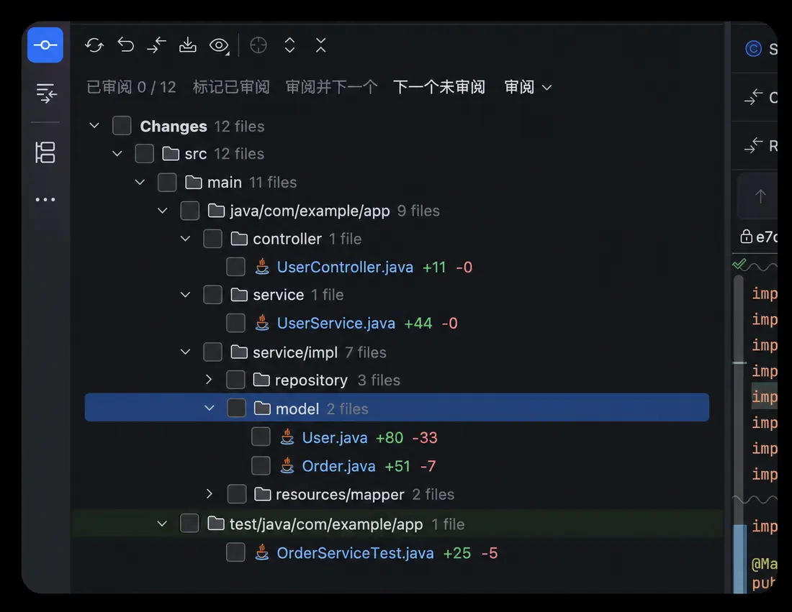

# ChangeLines

在 IntelliJ IDEA 原生 **Changes 文件树**中显示每个文件的 `+新增 / -删除` 行数，并记录哪些差异已经审阅。

**主要入口就是 `Changes Between…` 分支／标签／版本对比窗口，不是 Project View。工作区没有任何未提交修改时也应生效。**

最低 **IntelliJ IDEA 2026.1（261）**。CI 使用 2026.1 编译，验证 2026.1 和 2026.2.0.1；没有版本上限不代表已经验证全部未来版本。

## 界面示意



*示意图中的类名与路径均为通用示例。*

## 安装

到 [Releases](https://github.com/SubtleSpark/ChangeLines/releases/latest) 下载最新发布的 **ChangeLines ZIP**。

IDEA → Settings → Plugins → 齿轮 → Install Plugin from Disk… → 选择 ZIP → 重启。

不要解压 ZIP，不要下载 Source code，不需要自己装 JDK 或 Gradle。旧版直接覆盖更新。

## 文件夹汇总开关（0.3.4）

文件夹汇总**默认关闭**。在文件列表上方打开 **审阅 → 显示文件夹汇总**，勾选后显示目录的增删合计与子文件审阅进度；取消勾选即可隐藏。切换立即生效，无需重开比较。

开关只影响文件夹／模块／包分组后追加的汇总信息，包括合计、审阅进度、需重审和跳过提示；IDEA 原生的文件数、单个文件的行数与状态、顶部总进度保持不变。**关闭汇总后，选中文件夹仍可批量标记或取消所有可审阅子文件。**

选择按项目保存在本机 workspace 中，同一项目的比较窗口共用，重启 IDEA 后保留。开关不清空、不修改审阅记录。

## 窄侧边栏显示（0.3.3）

空间足够时保持原来的行内排列；文字超出侧边栏右边界时，统计区域才固定在右侧，长路径／文件名用省略号截断：

```text
空间足够：  ReleaseDAO.java  src/dal  +80  -33
空间不足：  ReleaseDAO.java  strategyserv/src/…      +80  -33
文件夹：    java/com/atta/strategy/…  +131  -40  已审阅 1 / 2
```

文件和文件夹使用同一规则，不要求开启目录分组。拖动侧边栏宽度会自动切换；水平滚动时仍以当前可见区域为准，保留原生复选框、图标、选中／文件背景与红绿颜色。

特别窄时优先保留数字，尾部审阅说明可以省略，完整内容保留在 tooltip／无障碍名称中。如果宽度连复选框、图标和数字都容不下，仍需适当拓宽。这里只调整显示，不更改统计结果或审阅状态。

## 文件夹合计与批量审阅（0.3.2）

开启「显示文件夹汇总」后：

```text
main 20 files                 +276  -65  已审阅 5 / 20
  ReleaseServiceImpl.java      +12   -3  已审阅
  ReleaseDAO.xml                +5   -1
```

文件夹／模块／包分组的数字是**当前比较树中所有层级子文件的合计**，包含折叠子目录、删除文本文件和压缩显示的包路径，不会扫描磁盘上其他文件。

选中文件夹，点击上方原生工具栏 **标记已审阅**，所有可审阅子文件一起完成；全部完成后按钮变为 **取消已审阅**，可整体取消。支持多选文件夹以及父子目录、文件混选，重叠部分自动去重。

二进制、读取失败或内容超限项在目录批量操作中跳过，并显示数量；仍在核对的文件不会被跳过，需等其指纹计算完成。部分统计会明确标注，没有统计数据时不显示伪造的零行。直接多选文件仍保留完整核对后统一写入的规则。

文件夹本身不保存“已审阅”布尔值，进度由子文件计算。新加入或修改的文件会让文件夹重新显示未完成／需重审，不会继承之前的完成状态。原有红绿配色不变。

## 0.3.0 回退问题与 0.3.1 修复

0.3.0 错把入口迁成了 Project View + Local Changes，同时删除了 Changes Tree 集成。插件因此能够正常安装并通过基础加载测试，但不会对 `Changes Between…` 产生任何效果。这是产品场景回退，不是用户配置问题。

0.3.1 撤回这次入口迁移，恢复真实比较树、左右 revision 统计和比较级审阅状态；保留 2026+ 的 API 验证门禁。回归测试明确构造 `VcsChanges` 原生窗口、native ChangesBrowser、没有本地修改的历史比较，验证自动发现、行数、标记、删除文件和原生工具栏。

## 使用

打开原来的 `Changes Between…` 窗口即可看到：

```text
ReleaseServiceImpl.java    +12  -3  已审阅
ReleaseDAO.xml             +5   -1
ReleaseFacadeImpl.java     +8   -2  需重审
```

在文件列表上方的**原生工具栏**中直接操作：

- **标记已审阅／取消已审阅**：选中文件或文件夹后点击，支持多选。
- **审阅**菜单：标记、取消、显示文件夹汇总、重置当前比较。重置需确认，不影响其他比较。

顶部工具栏不再显示“审阅并下一个”和“下一个未审阅”，减少常驻按钮。对应 Action 仍保留，可按需通过 Keymap 或支持的右键菜单调用。

空间不足时按钮进入 IDEA 原生工具栏溢出菜单。对不使用 ChangesBrowser 标准工具栏的 ChangesTree，插件在列表上方放置同样的原生 ActionToolbar。没有自绘圆角或 Swing JMenu/JPopupMenu。

能明确关联到该比较树的原生 Diff 中也有标记／审阅并下一个按钮。它们绑定 Diff 实际显示的 `Change`，不会误标别的窗口选中的文件或整个文件夹。来源关闭、模型替换或归属不明确时禁用。

Keymap 搜索 `ChangeLines` 可绑定快捷键。普通 Local Changes 的标准右键菜单也保留审阅动作；动态创建的 Changes Between 右键菜单不再注入手写子菜单，使用工具栏即可。**本版没有实现行尾独立可点击按钮。**

## 进度、保存与失效

进度示例：`已审阅 7 / 40 · 跳过 2`。已知二进制、无法读取或内容过大的文件不计入可审阅分母；仍在计算的文件会显示核对中，不冒充已审阅。删除文本文件通过 before revision 审阅，不因为没有磁盘文件而跳过。

标记记录的是 **项目／比较上下文 + 左右路径 + 左右内容 SHA-256**，不是当前文件名或单个布尔值。对同一组分支重新比较，内容不变的文件保留标记，任一侧内容改变显示“需重审”。标记前必须拿到完整有效的两侧内容指纹，本地编辑后旧缓存不能被再次确认。打开文件本身不自动标记。

使用本机 IDEA 配置目录的 `options/ChangeLinesReviews.xml`，不写入项目，不参加 Settings Sync，不保存源代码。0.2.x 中相同比较的有效记录可以继续读取；0.3.0 的 workspace 本地修改标记不转换为历史比较标记，以免错误串用。

`Changes Between…` 使用项目路径和完整原生比较标签标题区分比较；标题或界面语言改变会产生新上下文。普通 Git Log 额外使用实际 revision 组合隔离；无法确定身份的第三方树只用窗口级临时记录。不要将此进度当作团队审批。
